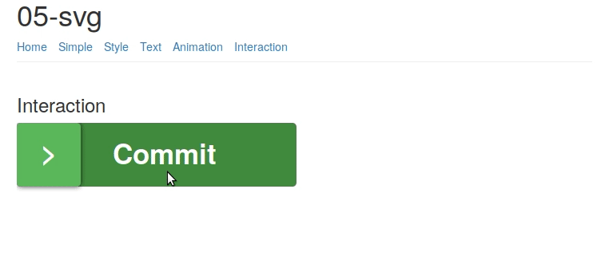

# 04-svg 🎨

## Assignment

> Your SVG Playground

## Setup

```bash
npm install
```

## Dev

```bash
grunt start
```

## Build

```bash
grunt
```

## Livedemo
+ On surge: [stefanelsat-svg.surge.sh](http://stefanelsat-svg.surge.sh)



